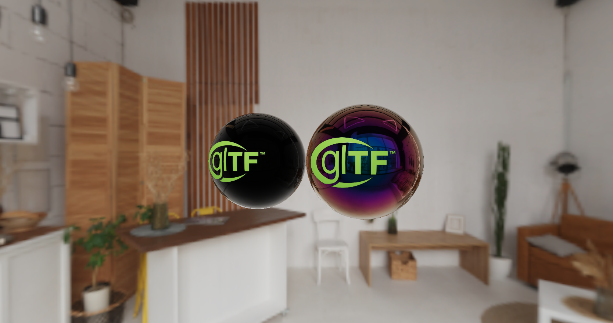

# WebGPU Render Engine

A lightweight experimental **WebGPU-based rendering engine** built from scratch.  
This project showcases my skills in **real-time graphics programming** and experiments with modern GPU APIs using WebGPU.

---

## ✨ Features
- **Physically Based Rendering (PBR)** with image-based lighting
- **WebGPU-first architecture** with explicit resource and pipeline management
- **Material system** supporting textures and shaders
- **Scalable and modular design** for extending rendering techniques
- **Efficient GPU resource caching** to minimize state changes

---

## 🚀 Getting Started

### Prerequisites
- A browser with [WebGPU support](https://developer.chrome.com/articles/webgpu/) (latest Chrome, Edge, or Safari Technology Preview)
- Node.js (v18+) and npm (or yarn/pnpm)

### Installation
```bash
git clone https://github.com/faran1385/webgpu-render-engine.git
cd webgpu-render-engine
npm install

```

---

## 📸 Screenshots & Demos

### Live Demo

👉 Try it [here](http://webgpu-render-engine.vercel.app/)

### Example Renders
    




---

## 📚 Learning Goals
- Experiment with **low-level rendering techniques**
- Showcase practical skills in **WebGPU and shader programming**
- Build a foundation for **future exploration** into shadows, post-processing, and advanced rendering features

